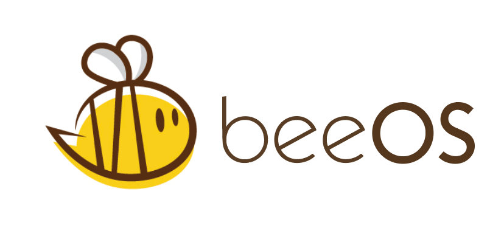
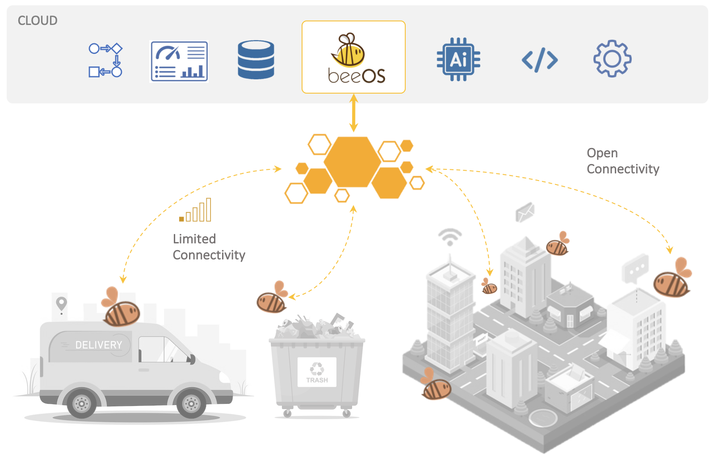

## Connect anything anywhere

BeeOS is a **scalable** and **flexible** IoT platform for **distributed connectivity** and **remote deployment** of workloads. It enables seamless integration of services using a diverse range of protocols and can be deployed in a variety of environments, from cloud to edge.

Designed as an end-to-end data pipeline, the platform **translates between protocols**, **collects data from local or remote** environments, **transforms** and **organizes** information, and delivers integrated **storage** and **visualization** capabilities. It brings **computation and intelligence to where the data is generated**, enabling code workloads and AI-driven processing to run even in remote or constrained environments for real-time decision-making.

Distributed **collectors and actuators can be deployed wherever they are needed** — at the edge or in the cloud — and **remotely provisioned and managed from a centralized control panel**, enabling scalable and unified operations across the entire infrastructure.

---



📖 Full documentation at [docs.beeos.net](https://docs.beeos.net)

# Bee Core SDK

This repository provides the **core Go SDK** for developing bee agents — the building blocks used to integrate any protocol or service into the BeeOS IoT platform. A bee agent connects to a hive, receives lifecycle events and model configuration, and implements the integration logic for a specific protocol, hardware device, or external service.

## Installation

```bash
go get github.com/beeosphere/bee
```

## Agent development

### Implementing an agent

Define your model and implement the `Agent` interface with `Started`, `Configured`, and `Stopped` lifecycle callbacks. The `AgentContext` passed to `Started` gives access to hive connectivity.

```go
type MyModel struct {
	Data string `json:"data"`
}

type MyAgent struct {
	log   models.Logger
	model *MyModel
}

func NewMyAgent(logger models.Logger) models.Agent {
	return &MyAgent{log: logger}
}

func (ag *MyAgent) Started(ac *models.AgentContext) error {
	ag.log.Info("MyAgent started")
	return nil
}

func (ag *MyAgent) Configured(model *models.Model) error {
	ag.log.Infof("MyAgent configured with model ID: %s", model.Id)
	return nil
}

func (ag *MyAgent) Stopped() error {
	ag.log.Info("MyAgent stopped")
	return nil
}
```

### Initializing the agent

Use `NewBee` with `WithAgentProvider` to wire your agent into the BeeOS runtime, then call `Buzz` to start it. `Buzz` blocks until the agent is shut down (e.g. via `Ctrl+C`).

```go
package main

import (
	"github.com/beeosphere/bee/agent/bee"
	"github.com/beeosphere/bee/agent/models"
)

func main() {
	var Manifest = models.AgentManifest{
		Name:    "MyAgent",
		Type:    "my-agent",
		Version: "1.0.0",
	}

	agent := bee.NewBee(
		bee.WithManifest(Manifest),
		bee.WithAgentProvider(func(logger models.Logger) models.Agent {
			return NewMyAgent(logger)
		}),
	)
	agent.Buzz()
}
```

## Configuration

Create a `config.toml` file to configure the agent identity and hive connection:

```toml
[agent]
id = "bee0"
key = "SUACEN57PJE3EQWYLQIY2SAYFU7O72VLFL3PQQIYJEZMW3VPT3FSB6GQLM"
hive = "localhost:8080"
log = "debug"
```

| Field  | Description                                              |
|--------|----------------------------------------------------------|
| `id`   | Unique identifier for this agent                         |
| `key`  | Authentication key used to connect to the hive           |
| `hive` | Address of the hive server                               |
| `log`  | Log level (`debug`, `info`, `warn`, `error`)             |

Then build the code and start your bee executable passing the config file:

```bash
./bee -c config.toml
```

## License

This project is licensed under the [MIT License](LICENSE).
